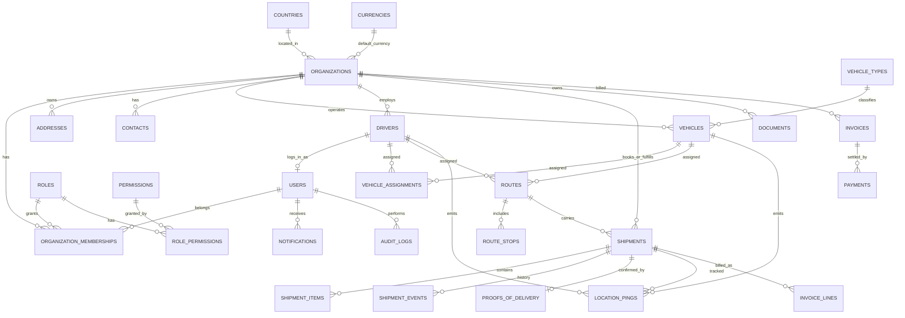

# MizigoX System Architecture

**Status:** Proposed — awaiting approval before Phase 1 implementation  
**Audience:** Product owner, engineering  
**First market:** Rwanda  
**Later markets:** Uganda, Kenya, Tanzania, Burundi, South Sudan, DRC

This document is the source of truth for how MizigoX will be built. It is an architecture and implementation plan, not working application code.

---

## 1. Repository analysis (current state)

The repository today is a **Vite + React JavaScript starter**, not a logistics platform.

| Area | Current state | Implication |
| --- | --- | --- |
| Frontend | React 19 + Vite 8, JavaScript (`.jsx`) | Must migrate to TypeScript |
| Styling | Global CSS (`App.css`, `index.css`) | Must introduce Tailwind CSS |
| Routing | Local `useState` page switcher | Must introduce a real router and portal shells |
| Data | In-memory dummy shipments | No persistence; must add PostgreSQL |
| Backend | None | Must add Node.js + Express + REST |
| Auth | None | Must add JWT auth and RBAC |
| Tooling | Oxlint only | Need shared TS, env validation, migrations, Docker |
| Existing UI | Shell nav + shipments list/create/filter | Treat as a **prototype**, not the final design |

What is worth keeping conceptually:

- The product name and freight/logistics positioning
- The intended module list (Dashboard, Shipments, Customers, Vehicles, Drivers, Routes, Tracking, Invoices)
- The idea of shipment references (`MX-#####`), search, status filter, and a create/details flow

What will be replaced:

- Client-only state
- Hardcoded sample customers and cities
- The current layout as the “final” admin UI
- The Vite template README as the project identity

**Decision:** start the application architecture from scratch. Reorganize into a monorepo. Do not extend the current `src/` tree as if it were the production frontend.

---

## 2. Product model

MizigoX is a **multi-tenant logistics operating system**.

There are three organization types:

1. **Platform** — MizigoX itself (Super Admin, Operations Admin, Finance Admin).
2. **Operator** — a transport / logistics company that owns vehicles, drivers, and routes. The first operator is MizigoX Rwanda.
3. **Customer** — a shipper organization that books freight, tracks cargo, and pays invoices.

```text
Platform (MizigoX)
 └── Operator organizations (transport companies)
      ├── Internal users (company admin, logistics, finance, drivers)
      ├── Vehicles, drivers, routes
      └── Customer organizations (shippers)
           └── Customer users
```

Rwanda-first means we seed **one platform org + one operator org**, but every operational record still has an organization and a country so East Africa expansion does not require a rewrite.

---

## 3. System architecture

### 3.1 High-level shape

```text
                    ┌─────────────────────────────────────────┐
                    │                 Clients                  │
                    │  Admin / Ops web   Customer portal       │
                    │  Driver portal     Public tracking page  │
                    └──────────────────┬──────────────────────┘
                                       │ HTTPS / JSON (REST)
                    ┌──────────────────▼──────────────────────┐
                    │              apps/api                    │
                    │  Express + TypeScript                    │
                    │  AuthN → AuthZ → Validation → Service    │
                    │  Feature modules (not a dump of routes)  │
                    └─────┬────────────┬──────────────┬───────┘
                          │            │              │
                 PostgreSQL      Object storage    Outbox
                 (system of      (docs / POD)      (email/SMS)
                  record)
```

### 3.2 Architectural principles

- **Clean separation.** Web, API, database, auth, and business logic are separate packages/layers. The React app never talks to PostgreSQL.
- **Vertical feature modules** on the API (`shipments`, `billing`, `tracking`), each with routes, validation, service, and repository.
- **Shared contracts.** Enums, Zod schemas, and TypeScript types live in `packages/shared` and are used by both apps.
- **Tenant isolation in every query.** A customer user cannot see another customer’s shipments. An operator sees only its own fleet and assigned customers.
- **Country as configuration, not hardcoded strings.** Currency, phone, address, and tax rules come from country/currency tables.
- **State machines over ad-hoc flags.** Shipment, invoice, and route statuses have explicit allowed transitions.
- **Append-only operational history.** Status changes, location pings, payments, and audit events are never silently overwritten.
- **Adapters at the edges.** Email, SMS, file storage, and maps are interfaces. Rwanda providers (and later others) plug in without changing domain logic.

### 3.3 Runtime (development → production)

| Environment | How it runs |
| --- | --- |
| Local / Cloud Agent | `docker-compose` for PostgreSQL; `apps/api` and `apps/web` as Vite/Node processes |
| Production (later) | API + web behind HTTPS; managed PostgreSQL; object storage; secrets from the environment only |

Phase 1 will not invent Kubernetes. It will make the app **deployable later** by keeping config, migrations, and process boundaries clean.

---

## 4. Proposed folder structure

```text
mizigox/
├── apps/
│   ├── api/                          # Express + TypeScript REST API
│   │   ├── src/
│   │   │   ├── server.ts             # HTTP listen
│   │   │   ├── app.ts                # Express app factory
│   │   │   ├── config/               # env, constants
│   │   │   ├── db/                   # pool, migrate runner, seeds
│   │   │   ├── middleware/           # auth, rbac, error, request-id
│   │   │   ├── lib/                  # logger, errors, crypto, pagination
│   │   │   └── modules/
│   │   │       ├── health/
│   │   │       ├── auth/
│   │   │       ├── identity/         # users, orgs, roles, countries
│   │   │       ├── customers/
│   │   │       ├── shipments/
│   │   │       ├── transport/        # vehicles, drivers
│   │   │       ├── routes/
│   │   │       ├── tracking/
│   │   │       ├── documents/
│   │   │       ├── billing/
│   │   │       ├── notifications/
│   │   │       ├── dashboard/
│   │   │       └── audit/
│   │   └── tests/
│   └── web/                          # React + Vite + TypeScript + Tailwind
│       └── src/
│           ├── main.tsx
│           ├── app/
│           │   ├── router.tsx
│           │   ├── providers.tsx
│           │   └── shells/           # AdminShell, CustomerShell, DriverShell
│           ├── features/             # one folder per product area
│           │   ├── auth/
│           │   ├── dashboard/
│           │   ├── shipments/
│           │   └── ...
│           └── shared/
│               ├── api/              # fetch client, token refresh
│               ├── auth/             # session, guards
│               ├── ui/               # design system primitives
│               └── lib/
├── packages/
│   └── shared/                       # types, enums, zod contracts, i18n keys
├── infra/
│   └── docker-compose.yml            # postgres (+ later mail/minio)
├── docs/
│   └── ARCHITECTURE.md               # this file
└── package.json                      # npm workspaces root
```

Each API module follows the same internal shape:

```text
modules/shipments/
├── shipment.routes.ts
├── shipment.controller.ts
├── shipment.service.ts
├── shipment.repository.ts
├── shipment.schemas.ts
└── shipment.transitions.ts
```

The current root `src/` tree is retired when Phase 1 lands. Useful UX ideas (reference numbers, search, status badges) move into `apps/web/src/features/shipments` in Phase 2.

---

## 5. Database architecture

PostgreSQL is the system of record. UUID primary keys. Timestamps in UTC. Money is **never** a floating-point type.

### 5.1 Conventions

- `id UUID PRIMARY KEY DEFAULT gen_random_uuid()`
- `created_at`, `updated_at`
- `created_by_user_id`, `updated_by_user_id` where a human made the change
- Soft delete (`deleted_at`) for master data (orgs, customers, vehicles, users)
- Hard delete never for shipments, invoices, payments, audit, or location history
- `country_code CHAR(2)` and `currency_code CHAR(3)` as first-class FKs
- Phone numbers stored in **E.164** (`+2507…`)
- Extensibility via `metadata JSONB` for country-specific extras, not extra columns per country
- Check constraints for enums that are part of the domain

### 5.2 Entity-relationship overview



### 5.3 Core domains and tables

#### Platform and identity

| Table | Purpose |
| --- | --- |
| `countries` | RW, UG, KE, TZ, BI, SS, CD plus name, ISO3, phone prefix, timezone, address field schema, active flag |
| `currencies` | RWF, UGX, KES, TZS, BIF, SSP, CDF, USD; `decimal_places` (RWF=0, KES=2) |
| `organizations` | Platform, operator, or customer; legal name, TIN/registration, country, default currency, status |
| `users` | Login identity; email, phone, password hash, language, timezone, status |
| `roles` | System roles listed in §7 |
| `permissions` | `resource.action` codes such as `shipments.create` |
| `role_permissions` | Role → permission map |
| `organization_memberships` | User belongs to an org with exactly one role in that org |
| `refresh_tokens` | Hashed refresh tokens, expiry, revoke, device metadata |
| `password_reset_tokens` | Single-use hashed reset tokens |
| `audit_logs` | Who did what, to which entity, before/after JSON, IP, request id |

#### Customers

Customer **is** an `organizations` row with `type = CUSTOMER`. Extra profile fields can live on `customer_profiles` if they should not pollute operator orgs.

| Table | Purpose |
| --- | --- |
| `customer_profiles` | Credit terms, account manager, preferred operator, billing notes |
| `contacts` | Named people at an organization |
| `addresses` | Reusable structured addresses for orgs, contacts, and stops |

Address fields are East-Africa-ready: country, admin area (province/region), district, locality, sub-locality (sector/ward), street lines, landmark, postal code, lat/lng.

#### Shipments

| Table | Purpose |
| --- | --- |
| `shipments` | Booking header: reference, parties, status, cargo summary, ETAs, assignment FKs, origin/destination countries, currency |
| `shipment_items` | Pieces, weight, L×W×H, hazardous/stackable flags |
| `shipment_events` | Timeline: booked, assigned, picked up, in transit, delivered, exception |
| `proofs_of_delivery` | Recipient name, signature/photo document ids, captured by, timestamp |

**Shipment reference format:** `MX-{ISO2}-{YYYY}-{NNNNN}`  
Example: `MX-RW-2026-00001`. Sequence is per country per year so later markets do not collide.

**Shipment status machine:**

```text
DRAFT → BOOKED → ASSIGNED → PICKUP_IN_PROGRESS → IN_TRANSIT
  → OUT_FOR_DELIVERY → DELIVERED

BOOKED / ASSIGNED / IN_TRANSIT → EXCEPTION
Any pre-delivery status → CANCELLED
EXCEPTION → IN_TRANSIT | CANCELLED | DELIVERED (after resolution)
```

#### Transport

| Table | Purpose |
| --- | --- |
| `vehicle_types` | Van, pickup, 3T/7T truck, trailer, motorcycle |
| `vehicles` | Registration (country-specific), VIN, capacity, status, availability, last known position |
| `drivers` | Linked `user_id`, license number/class/country/expiry, availability |
| `vehicle_assignments` | Dated assignment of driver ↔ vehicle (history, not only a current FK) |
| `driver_documents` / `vehicle_documents` | Typed links to `documents` with expiry dates |

Availability is explicit (`AVAILABLE`, `ON_TRIP`, `OFF_DUTY`, `MAINTENANCE`) and updated by assignment and trip events, not guessed from shipments.

#### Routes

| Table | Purpose |
| --- | --- |
| `routes` | A vehicle trip: operator, vehicle, driver, status, distance_km, eta |
| `route_stops` | Ordered stops with address, planned/actual times, stop type (pickup/delivery/waypoint) |
| `route_stop_shipments` | Which shipment is picked up or delivered at which stop |

A simple point-to-point shipment can still create a two-stop route when assigned. Multi-stop comes for free.

#### Tracking

| Table | Purpose |
| --- | --- |
| `location_pings` | Driver/vehicle GPS samples: lat, lng, accuracy, heading, speed, recorded_at |
| `tracking_links` | Public token for the customer tracking page |

Phase 1 stores coordinates as `NUMERIC`. PostGIS and live WebSockets are **later**, once volume justifies them. The API shape will already treat “last known position + history” as first-class so the frontend does not have to change.

#### Documents

| Table | Purpose |
| --- | --- |
| `documents` | File metadata + storage key + visibility (`INTERNAL`, `CUSTOMER`, `DRIVER`) + owner entity |

Storage is an interface: local disk in development, S3-compatible in production.

#### Billing

| Table | Purpose |
| --- | --- |
| `invoices` | Number, parties, currency, tax, totals, amount_paid, amount_due, status, due date, country (tax regime) |
| `invoice_lines` | Description, qty, unit amount, optional `shipment_id` |
| `payments` | Amount, method (`MOBILE_MONEY`, `BANK_TRANSFER`, `CASH`, `CARD`), provider reference, status |

**Money rule:** store `NUMERIC(19, 4)` + `currency_code`. Display uses `currencies.decimal_places` (RWF shows 0 decimals). Never convert currencies implicitly; multi-currency invoices are explicit later.

#### Notifications and operations

| Table | Purpose |
| --- | --- |
| `notifications` | In-app inbox |
| `notification_deliveries` | Email/SMS outbox: channel, provider, status, error |
| `operational_alerts` | Late shipment, expiring license, unassigned booking, vehicle silent |

---

## 6. API architecture

### 6.1 Style

- REST, JSON, versioned: `/api/v1/...`
- One API for all portals. Authorization and tenant filters change the data, not the URL namespace.
- Public exceptions: `POST /api/v1/auth/login`, password reset, `GET /api/v1/track/:reference` (token required).

**Success envelope**

```json
{
  "data": {},
  "meta": { "requestId": "…", "page": 1, "pageSize": 25, "total": 100 }
}
```

**Error envelope**

```json
{
  "error": {
    "code": "SHIPMENT_INVALID_TRANSITION",
    "message": "Cannot move a delivered shipment back to booked.",
    "details": [],
    "requestId": "…"
  }
}
```

### 6.2 Cross-cutting API rules

- `Authorization: Bearer <access_token>`
- Refresh via `httpOnly` cookie on `/api/v1/auth/refresh`
- Zod validation on every write
- `X-Request-Id` on every response
- Cursor or page/limit pagination; default page size 25, max 100
- List endpoints support `q`, status, country, date range, and org-scoped filters
- Idempotency-Key header on shipment create, invoice issue, and payment record
- Rate limits on auth and public tracking

### 6.3 Resource map (full product; not all in Phase 1)

| Area | Endpoints |
| --- | --- |
| Auth | `POST /auth/login`, `/auth/refresh`, `/auth/logout`, `GET /auth/me`, password change/reset |
| Identity | `/organizations`, `/users`, `/memberships`, `/countries`, `/currencies` |
| Customers | `/customers`, `/customers/:id/contacts`, `/customers/:id/addresses` |
| Shipments | `GET/POST /shipments`, `GET/PATCH /shipments/:id`, `/shipments/:id/items`, `/shipments/:id/events`, `/shipments/:id/assign`, `/shipments/:id/status`, `/shipments/:id/pod` |
| Transport | `/vehicle-types`, `/vehicles`, `/drivers`, `/vehicles/:id/assignments` |
| Routes | `/routes`, `/routes/:id/stops`, `/routes/:id/assign` |
| Tracking | `POST /tracking/pings`, `GET /shipments/:id/tracking`, `GET /track/:reference` |
| Documents | `/documents` (upload metadata + signed URL or multipart) |
| Billing | `/invoices`, `/invoices/:id/issue`, `/invoices/:id/payments`, `/payments` |
| Notifications | `GET /notifications`, `POST /notifications/:id/read` |
| Dashboard | `GET /dashboard/summary`, `GET /dashboard/activity`, `GET /dashboard/alerts` |

### 6.4 Request flow

```text
Client
  → helmet / cors / request-id
  → rate limit
  → authenticate JWT (except public routes)
  → authorize permission
  → apply tenant scope
  → validate body/query
  → service (domain rules, transactions)
  → repository (SQL)
  → audit log (mutating operations)
  → notification outbox (when relevant)
```

---

## 7. Authentication and authorization

### 7.1 Authentication

| Item | Choice |
| --- | --- |
| Password hashing | argon2id |
| Access token | JWT, 15 minutes, sent as Bearer token, not stored in localStorage long-term beyond memory + session handling |
| Refresh token | Opaque, hashed in `refresh_tokens`, 7 days, `httpOnly` + `Secure` + `SameSite=Lax` cookie |
| JWT claims | `sub`, `orgId`, `orgType`, `role`, `permissions`, `countryCode`, `jti`, `iat`, `exp` |
| Lockout | Temporary lock after repeated failed logins |
| Verification | Email verification in Phase 1; phone login later for drivers |

Logout revokes the refresh token. Password change revokes all refresh tokens for that user.

### 7.2 Roles

| Role | Scope | Typical access |
| --- | --- | --- |
| Super Admin | Platform | All tenants, country config, system users |
| Operations Admin | Platform | Cross-operator operations, alerts, shipments (no bank/payout admin) |
| Finance Admin | Platform | Cross-operator invoices, payments, outstanding balances |
| Company Admin | Operator | That company’s users, fleet, customers, shipments, billing settings |
| Logistics Manager | Operator | Shipments, routes, vehicles, drivers, assignment, tracking |
| Finance Officer | Operator | Invoices, payments, documents, balances for that company |
| Driver | Operator | Assigned trips, status updates, POD upload, own location, own vehicle |
| Customer Admin | Customer | Org profile, users, shipments, documents, invoices *(recommended addition)* |
| Customer User | Customer | Create/view/track own org shipments, view docs and invoices |

`Customer Admin` is not in the original list. It is required if customers will “manage their organization and users.” If you prefer a single Customer User role with a `can_manage_users` flag, say so before Phase 1.

### 7.3 Permission model

Roles are bundles of permissions. Services check **permissions**, not role names, except for a few platform-only operations.

Examples:

- `shipments.create` `shipments.read` `shipments.update` `shipments.assign` `shipments.update_status` `shipments.upload_pod`
- `customers.manage` `fleet.manage` `invoices.manage` `payments.record`
- `users.manage` `org.settings` `dashboard.finance` `tracking.update_location`
- `audit.read` `countries.manage`

Tenant rules are applied after permission checks:

- Customer roles: `organization_id = current customer`.
- Operator roles: shipments where `operator_organization_id = current operator`.
- Platform roles: optional `operatorId` filter, never implicit cross-tenant leakage.

### 7.4 Portal routing (frontend)

| Path prefix | Audience |
| --- | --- |
| `/login` | All |
| `/admin` | Platform + operator staff |
| `/portal` | Customer Admin / Customer User |
| `/driver` | Driver |
| `/track/:reference` | Public, tokenized |

The current single-sidebar app becomes three shells with a shared design system. A user with one membership lands in the matching shell. Super Admin never uses the driver shell.

---

## 8. Security architecture

Phase 1 must include the security skeleton, even if later modules are empty.

- Env vars validated at boot (`zod`). No secrets in git. `.env.example` only.
- Helmet, strict CORS, JSON body size limits
- Parameterized SQL only
- Central error handler that does not leak stack traces in production
- Audit log on auth success/failure and all writes to identity, shipments, billing
- File uploads: type/size checks, stored outside the web root, signed download URLs
- CSRF risk reduced by cookie refresh on a dedicated path + SameSite
- Common web protections: XSS (React defaults + CSP later), SQLi, overposting (Zod pick), IDOR (tenant scope)

---

## 9. East Africa readiness (design now, activate later)

Phase 1 seeds all seven countries and their currencies as **inactive except Rwanda / RWF**.

| Concern | Approach |
| --- | --- |
| Currency | Org default currency; invoice locked to one currency; decimal places per currency |
| Phone | E.164; country prefix from `countries` |
| Address | Country-specific required fields in `countries.address_schema` |
| Shipment refs | Country in the reference |
| Regulations | `metadata` / later `regulatory_profiles` for axle limits, transit docs, border posts |
| Language | `users.preferred_language`: `en`, `fr`, `sw`, `rw` — UI English first |
| Time | Store UTC; display in org/user timezone (`Africa/Kigali` first) |
| Payments | Method enum includes mobile money from day one; provider adapters later (MTN MoMo, Airtel Money, etc.) |

Cross-border shipments are modeled from the start (`origin_country_code`, `destination_country_code`) even while we only operate domestically in Rwanda.

---

## 10. Frontend architecture

- React + Vite + TypeScript + Tailwind CSS
- React Router for portals
- TanStack Query for server state
- Small auth store (context or Zustand)
- Feature folders, not a `components/` junk drawer
- Shared UI kit: page header, data table, status badge, drawer/form, empty/error states
- No business logic in presentational components

The existing shipments page is a **UX sketch**. Phase 2 will rebuild it against the API with real customers, addresses, and the status machine.

---

## 11. Phased development plan

Do not implement the whole product in one step. Each phase ships a thin vertical slice that is testable and reviewable.

### Phase 1 — Foundation (implement first)

Goal: a production-shaped skeleton that later modules plug into.

- npm workspaces monorepo (`apps/api`, `apps/web`, `packages/shared`)
- TypeScript everywhere; Tailwind on web
- Docker Compose PostgreSQL
- Migrations for countries, currencies, orgs, users, roles, permissions, memberships, refresh tokens, audit logs
- Seed: Rwanda + RWF active; other EAC countries present but inactive; Super Admin; MizigoX platform + Rwanda operator
- Auth: register-invite/login/refresh/logout/me, argon2id, JWT, RBAC middleware
- API health + env validation + error envelope + request ids
- Web: login, authenticated admin shell, role-aware nav placeholders, logout
- Replace the Vite starter as the running app

**Out of scope for Phase 1:** shipments CRUD against the database, fleet, billing, GPS, email/SMS providers.

### Phase 2 — Customers and shipments

- Customer orgs, contacts, addresses
- Shipment create/list/detail/search/filter
- Reference numbers and status machine + event timeline
- Admin shipment UI (replaces the current local-state page)
- Customer portal: list/create/view

### Phase 3 — Transport and assignment

- Vehicle types, vehicles, drivers, document expiry fields
- Availability
- Assign vehicle/driver to a shipment
- Driver portal: assigned trips (read-only first)

### Phase 4 — Routes

- Multi-stop routes, stop order
- Distance and ETA fields (manual or stubbed calculator)
- Route status and assignment

### Phase 5 — Real-time tracking

- Location ping API
- Shipment tracking timeline on admin + customer pages
- Public tracking page
- Driver location share
- Architecture ready for WebSockets later; polling first

### Phase 6 — Documents and billing

- Document upload/download
- Delivery notes, POD
- Invoice generation, statuses, payments, outstanding balances
- RWF-first money display
- Dashboard revenue + outstanding invoices

### Phase 7 — Notifications, driver completion, alerts

- In-app notifications
- Email and SMS adapter interfaces + first Rwanda-capable stubs
- Shipment/delivery/invoice notification events
- Driver POD upload and status updates
- Operational alerts on the admin dashboard

### Phase 8 — Regional hardening

- Activate additional countries
- Country address/phone validation
- Additional currencies on invoices
- Regulatory metadata and border-oriented shipment fields

---

## 12. What should be implemented first

**Phase 1 only**, after this architecture is approved.

That is the correct first cut because every later module depends on:

1. Tenant-aware organizations
2. Users and RBAC
3. Country/currency configuration
4. A versioned API and a TypeScript client
5. Audit and secure env handling

Building shipments on top of the current in-memory React page would lock in the wrong data model.

### Phase 1 acceptance criteria

- `docker compose up` starts PostgreSQL
- API boots, migrates, seeds, and serves `/api/v1/health`
- Super Admin can log in and receive a JWT + refresh cookie
- `/api/v1/auth/me` returns role and permissions
- A Customer User token cannot call a platform-only route
- Web login redirects to the admin shell
- Unauthenticated users cannot open `/admin`
- No secrets committed; `.env.example` documents required variables

---

## 13. Decisions to confirm before Phase 1

Please approve or adjust these before implementation starts:

1. **Monorepo** with `apps/api`, `apps/web`, `packages/shared` (recommended).
2. **Add Customer Admin** as a first-class role.
3. **Replace** the current root React app rather than incrementally wrapping it.
4. **Phase 1 = foundation only** (identity, auth, RBAC, country seed, app shells). Shipments persist in Phase 2.
5. **Money** as `NUMERIC + currency_code`; display rules per currency decimal places.
6. **Shipment references** as `MX-{COUNTRY}-{YEAR}-{SEQ}`.

Once these are approved, Phase 1 implementation can begin on a dedicated branch.
